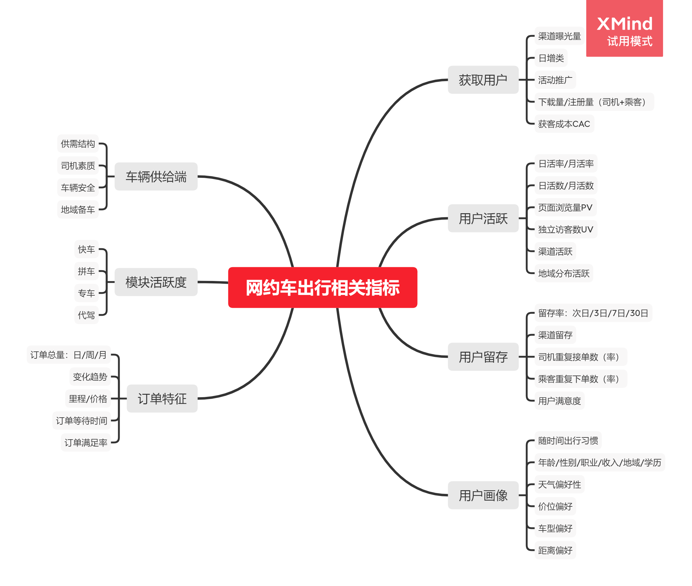

# 网约车Uber 出行数据分析
 
工具：Pandas、Matplotlib、Seaborn、Tableau  
注：个人实战锻炼项目，欢迎交流与勘误

## 项目背景
### 项目概览：
根据Uber真实订单数据，利用相关业务指标对基公司运营及用户出行特征进行分析，进一步了解网约车出行行业，总结网约车运营过程中应关注的点，指导出行服务进行精细化运营以及用户增长。

### 数据来源与说明：
- ①https://www.kaggle.com/fivethirtyeight/uber-pickups-in-new-york-city
- ②https://www.kaggle.com/zusmani/uberdrives

### 数据集①

2014年（4月至9月）的Uber行程数据，按月分隔，并提供详细的位置信息

Date/Time ：Uber接单的日期和时间  
Lat ：Uber接单的纬度  
Lon ：Uber接单的经度  
Base：与Uber接单相关的TLC基本公司代码  

这些文件名为：  
`uber-raw-data-apr14.csv`  
`uber-raw-data-aug14.csv`  
`uber-raw-data-jul14.csv`  
`uber-raw-data-jun14.csv`  
`uber-raw-data-may14.csv`  
`uber-raw-data-sep14.csv`

### 数据集②
2016年的Uber行程数据，按月分隔，提供地理位置（USA, Sri Lanka and Pakistan）

START_DATE*：Uber接单开始日期时间  
END_DATE*：Uber接单结束日期时间  
CATEGORY*：出行类型  
START*：起始位置  
END*：结束位置  
MILES*：里程  
PURPOSE*：出行目的  

文件名：  
`My Uber Drives - 2016.csv`

## 业务指标

在进行数据分析之前，先要了解相关业务指标，以便更有针对性地进行数据分析，更有利于驱动产品精细化运营/用户的增长。

## 数据分析

根据上述的数据分析流程，对Uber运营情况进行分析，进一步了解网约汽车出行行业  

[数据集①数据分析详细](https://github.com/Kam-hung/My-Uber-Drives/blob/297b5a01f780ef08f07be9187bfd03542248a303/uber_2014%20data%20analysis.ipynb)  
[数据集②数据分析详细](https://github.com/Kam-hung/My-Uber-Drives/blob/f79650c933028aa5f8e81c2f09f671579f1fcd03/uber_2016%20data%20analysis.ipynb)
